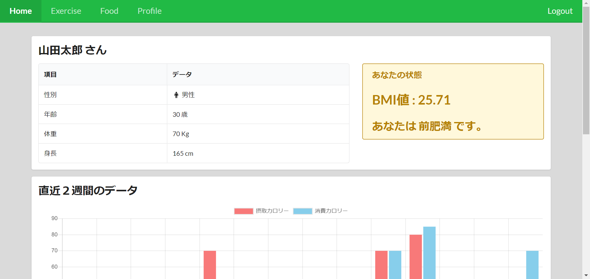

# サニタス

### [サニタスアプリのサイト](http://team1-final-internship.s3-website-ap-northeast-1.amazonaws.com)

## Home ページ

## 説明

個人の体に合った身体管理を行うことができます。身体情報から分析し、食生活や運動メニューを提案します。

## 機能

- ログイン
- サインイン
- 食事の記録
- 運動を記録
- 身体情報から各種値(BMI など)の計算

> エムティーアイのインターンシップで作業したプロジェクトです。